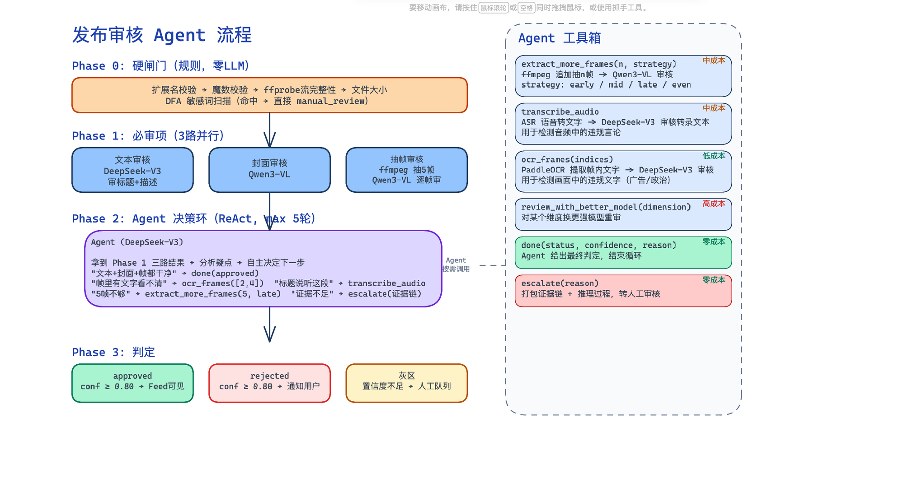
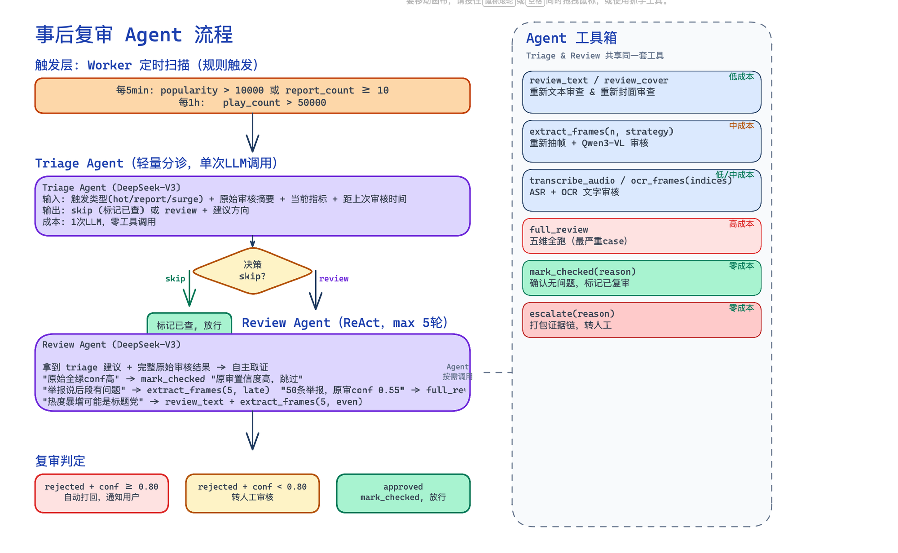

# FeedAI

短视频 Feed 流与 AI 智能分析平台

许可：MIT Go 1.24+ Docker Compose 7 服务编排 由 Go + React + AI 驱动

从零构建的生产级短视频信息流系统
🔥 冷热分离 Feed 引擎 • 🤖 AI 智能视频分析 • 🛡️ AI 内容审核 Agent • ⚡ 异步 Worker 集群 • 🎯 多级缓存架构

🚀 快速启动 • ✨ 核心创新 • 🏗️ 系统架构 • 📦 功能模块

🌐 中文版

---

## 📖 简介

FeedAI 是一个从零构建的生产级短视频 Feed 流平台，融合 AI 智能分析与内容安全能力，完整覆盖视频发布、信息流分发、社交互动、实时通知、AI 视频理解和 AI 内容审核六大核心场景。

与简单 CRUD 项目不同，FeedAI 深入解决了 Feed 流系统的核心挑战：

🔥 **冷热分离**：Redis ZSET 热数据毫秒级查询 + MySQL 冷数据兜底，跨边界无缝翻页
🧠 **AI 原生集成**：视频语音转文字 → DeepSeek 智能总结，全链路异步分析
🛡️ **AI 内容审核**：ReAct Agent 驱动的多模态审核（文本 + 封面 + 视频帧 + ASR），发布前把关 + 事后复审双保险
⚡ **异步化设计**：RabbitMQ Worker 集群解耦点赞/评论/关注，API 响应与热度更新完全异步
🔒 **弹性架构**：多级缓存、优雅降级、熔断限流、指数退避重试，生产就绪

> FeedAI 后端包含 ~9500 行 Go 代码、21 个 Go 包（三层架构）、50+ 个 RESTful API 端点、10 张数据表，Docker Compose 一键部署 7 个微服务。

**给我们一颗星 ⭐**

---

## 🖼️ 展示

前端采用抖音 PC 版风格，React 18 + TypeScript + Tailwind CSS + Zustand 状态管理：

- **Feed 首页**：瀑布流视频卡片，自动播放，点赞/评论/分享
- **视频详情页**：全屏播放 + 评论抽屉 + AI 分析摘要
- **个人主页**：用户信息、作品列表、粉丝/关注统计
- **发布页**：视频上传（分片 + 断点续传 + MD5 秒传）
- **AI 分析页**：视频 AI 分析结果展示、语音转文字、智能总结
- **消息通知页**：SSE 实时推送，点赞/评论/关注通知

---

## 🚀 核心创新

### 1️⃣ Feed 流冷热分离引擎 ⭐⭐⭐

FeedAI 拒绝简单的 `SELECT * ORDER BY created_at LIMIT 20`，构建了真正的冷热分离 + 游标分页架构：

**热数据路径**（< 3ms）：
```
用户请求 → Redis ZSET feed:global_timeline → ZREVRANGE 游标分页
```
新发布视频写入 ZSET，按创建时间排序，毫秒级返回。

**冷热缝合路径**（30-50ms）：
```
热数据不足 → 游标穿透至 MySQL → singleflight 合并请求 → 补全冷数据
```
当热数据不足一页时，自动拼接 MySQL 冷数据，`latest_time` 游标跨冷热边界无缝翻页。

**核心机制**：
- **ZSET 灾备重建**：Redis 清空时用 `singleflight` 全局锁从 MySQL 重建 1000 条时间线
- **热度排行**：60 个分钟级快照滑动窗口聚合（`ZUnionStore`），实现滚动 1 小时热度榜
- **冷数据下沉**：热度不足的视频自动降级到 MySQL，热数据始终控制在 ZSET 内

### 2️⃣ 三级缓存体系 ⭐⭐⭐

```
L1 本地缓存 (go-cache, 3-5s TTL)
  → L2 Redis (JSON 序列化, 1h TTL)
    → L3 MySQL (兜底查询 + singleflight 防击穿)
```

- **批量查询优化**：`GetVideoByIDs` 实现批量三级缓存查询，L2 命中异步回写 L1
- **防缓存击穿**：`ListByFollowing` 使用 Redis 分布式锁，锁失败则轮询等待
- **防缓存穿透**：`singleflight` 合并并发请求，防止 Redis 过期瞬间大量请求击穿 MySQL

### 3️⃣ 异步 Worker 集群 ⭐⭐

FeedAI 将高频写入操作（点赞/评论/关注）与 API 主路径完全解耦：

```
用户操作 → API 立即响应（写 DB + 投递 MQ）
         → RabbitMQ Topic 路由
              ├── LikeWorker     → 更新点赞计数 + 热度积分
              ├── CommentWorker  → 更新评论计数 + 热度积分
              ├── SocialWorker   → 更新关注/粉丝计数
              ├── PopularityWorker → 热度排行更新
              ├── NotificationWorker → SSE 实时推送
              ├── OutboxPoller   → 发件箱投递 → TimelineConsumer → ZSET 维护
              └── DLX 死信队列   → 消费失败自动路由 → 超限丢弃
```

**工程保障**：
- **幂等性**：所有 Worker 支持重复消费（`IgnoreDuplicate`），DLX 超限丢弃
- **指数退避重试**：AI 分析 Worker 3 次重试（2s / 4s / 8s）
- **Outbox 发件箱模式**：视频发布先写 MySQL `outbox_msgs` 表，Poller 轮询投递，保证不丢消息

### 4️⃣ AI 智能视频分析 ⭐⭐

```
视频上传 → FFmpeg 提取音频 → SiliconFlow ASR 语音转文字
         → DeepSeek 模型智能总结 → 结构化 Markdown 输出
```

- **运行时配置**：API Key / Model / BaseURL 可运行时动态更新，`sync.RWMutex` 保证并发安全
- **令牌桶限流**：全局 AI 调用 10次/min，防止 API Key 额度耗尽
- **异步分析**：提交后立即返回，Worker 异步处理，前端轮询结果

### 5️⃣ AI 内容审核 Agent ⭐⭐⭐

FeedAI 构建了一套基于 **ReAct 循环**的多模态内容审核系统，分发布前把关与事后复审两个 Agent。

**发布审核 Agent 流程**：



```
Phase 0 硬闸门（零 LLM）
  扩展名/魔数校验 → ffprobe 完整性 → 文件大小 → DFA 敏感词扫描
        ↓ 通过
Phase 1 三路并行审核
  文本审核(DeepSeek-V3) + 封面审核(Qwen3-VL) + 抽帧审核(ffmpeg+Qwen3-VL)
        ↓
Phase 2 Agent 决策环（ReAct，max 5轮）
  Agent 分析三路结果 → 自主决定调用工具 or 给出最终判定
  可用工具: extract_more_frames / transcribe_audio / ocr_frames / review_with_better_model
        ↓
Phase 3 判定
  approved(conf≥0.80) → Feed可见
  rejected(conf≥0.80) → 通知用户
  灰区(置信度不足)    → 人工队列
```

**事后复审 Agent 流程**：



```
触发层（Worker 定时扫描）
  每5min: popularity > 10000 或 report_count ≥ 10
  每1h:   play_count > 50000
        ↓
Triage Agent（轻量分诊，单次 LLM）
  输入触发类型 + 原始审核摘要 → 输出 skip 或 review + 建议方向
        ↓ review
Review Agent（ReAct，max 5轮）
  拿到 triage 建议 + 完整原始审核结果 → 自主取证 → 给出复审判定
        ↓
复审判定
  rejected(conf≥0.80) → 自动打回，通知用户
  rejected(conf<0.80) → 转人工审核
  approved            → mark_checked，放行
```

**工程亮点**：
- **成本分层**：硬闸门（零LLM）→ 并行三路（低成本）→ Agent按需调工具（中成本）→ 人工兜底
- **Triage 前置**：事后复审先用单次 LLM 轻量分诊，skip 掉明显没问题的视频，降低 90% 无效 Review Agent 调用
- **工具箱设计**：`extract_more_frames` / `transcribe_audio` / `ocr_frames` / `review_with_better_model` / `done` / `escalate`，Agent 按需选用
- **置信度阈值**：高置信（≥0.80）AI 自主决策，灰区（<0.80）转人工，可配置
- **人工审核后台**：管理员接口支持手动 approve/reject，`/review/pending` 查看待审队列

### 6️⃣ JWT 双模式鉴权 ⭐

- **硬鉴权**：需登录接口（发布视频、评论、关注等），token 无效直接 401
- **软鉴权**：公开接口（Feed 流、视频详情），有 token 则标注用户身份（已点赞、已关注），无 token 则匿名访问
- **Token 防重放**：签发时同步写入 Redis + MySQL，验证时双写比对，登出即撤销
- **Refresh Token**：access token 15min 过期，前端自动无感刷新

---

## 📦 功能模块

| 模块 | 功能 | 技术要点 |
|------|------|----------|
| **账号系统** | 注册/登录/个人信息/Token 管理 | JWT 双模式鉴权、Bcrypt 加密、IP 限流 |
| **视频管理** | 发布/删除/列表/详情 | MinIO 分片上传、MD5 秒传、断点续传 |
| **Feed 流** | 全局时间线/关注流/热度排行 | ZSET 冷热分离、游标分页、三级缓存 |
| **社交互动** | 点赞/评论/关注/粉丝 | 异步落库、Outbox 模式、乐观锁 |
| **AI 分析** | 语音转文字/视频智能总结 | FFmpeg + ASR + DeepSeek、令牌桶限流 |
| **AI 内容审核** | 发布前把关/事后复审/人工队列 | ReAct Agent、多模态审核、置信度阈值、DFA敏感词 |
| **通知系统** | 实时推送点赞/评论/关注 | SSE Hub、30s 心跳保活、多端在线 |
| **媒体管理** | 上传/下载/分片 | MinIO 对象存储、5MB 分片、upload_id 追踪 |

---

## 🏗️ 系统架构

```
┌─────────────────────────────────────────────────────┐
│                  React SPA (:5173)                   │
│          TypeScript + Tailwind + Zustand             │
└───────────────┬─────────────────────────────────────┘
                │ HTTP REST + SSE
┌───────────────▼─────────────────────────────────────┐
│               Gin API Server (:8080)                 │
│  ┌──────┬──────┬──────┬──────┬──────┬────────────┐  │
│  │用户  │视频  │Feed  │互动  │社交  │AI分析  │通知│  │
│  │模块  │模块  │模块  │模块  │模块  │媒体   │SSE │  │
│  └──────┴──────┴──────┴──────┴──────┴──────┬──┴────┘  │
│                                            │         │
│  ┌─────────────────────────────────────────▼──────┐  │
│  │ 中间件层: JWT(硬+软鉴权) · 限流(令牌桶)         │  │
│  │ 优雅降级 · 指数退避重试 · pprof 可观测          │  │
│  └────────────────────────────────────────────────┘  │
└──────────────┬──────────────┬───────────┬───────────┘
               │              │           │
┌──────────────▼──┐  ┌────────▼───┐  ┌───▼──────────┐
│    MySQL 8.0    │  │  Redis 7   │  │ RabbitMQ 3   │
│  (主存储+事务)   │  │(缓存+锁+ZK)│  │ (异步Worker) │
└─────────────────┘  └────────────┘  └───┬──────────┘
                                         │
┌────────────────────────────────────────▼────────────┐
│             RabbitMQ Workers (异步)                   │
│  ┌─────────┬──────────┬──────────┬────────────────┐  │
│  │Like     │Comment   │Social    │Popularity      │  │
│  │Worker   │Worker    │Worker    │Worker          │  │
│  └─────────┴──────────┴──────────┴────────────────┘  │
│  ┌───────────┬─────────────┬──────────────────────┐  │
│  │Outbox     │Notification │Timeline Consumer     │  │
│  │Poller     │Worker(SSE)  │(ZSET 时间线维护)      │  │
│  └───────────┴─────────────┴──────────────────────┘  │
│  ┌──────────────────────────────────────────────────┐  │
│  │         Review Worker (定时事后复审)               │  │
│  │  Triage Agent → Review Agent → 打回/放行/转人工   │  │
│  └──────────────────────────────────────────────────┘  │
└──────────────────────────────────────────────────────┘

┌──────────────────────────────────────────────────────┐
│                  MinIO 对象存储                        │
│           (分片上传 · MD5 秒传 · 断点续传)             │
└──────────────────────────────────────────────────────┘
```

---

## 📋 目录结构

后端采用 **Gin 框架最佳实践**的三层架构：`api/` 路由层 → `internal/` 核心业务层 → `pkg/` 可复用基础设施层。

```
feedsystem_ai_go/
├── backend/                        # Go 后端服务
│   ├── cmd/
│   │   ├── main.go                 # API 服务入口
│   │   └── worker/main.go          # Worker 服务入口
│   │
│   ├── api/v1/                     # 路由注册层（Gin RouteGroup）
│   │   ├── router.go               # 总路由注册、中间件挂载
│   │   ├── account.go              # /account 路由组
│   │   ├── ai.go                   # /ai 路由组
│   │   ├── feed.go                 # /feed 路由组
│   │   ├── media.go                # /media 路由组
│   │   ├── notification.go         # /notification 路由组（SSE）
│   │   ├── review.go               # /review 路由组
│   │   ├── social.go               # /social 路由组
│   │   └── video.go                # /video 路由组
│   │
│   ├── internal/                   # 核心业务层（不可外部引用）
│   │   ├── controllers/            # 控制器层（请求解析/响应格式化）
│   │   │   ├── account.go          # 账号控制器
│   │   │   ├── ai.go               # AI 分析控制器
│   │   │   ├── comment.go          # 评论控制器
│   │   │   ├── feed.go             # Feed 流控制器
│   │   │   ├── like.go             # 点赞控制器
│   │   │   ├── media.go            # 媒体上传控制器
│   │   │   ├── message.go          # 消息通知控制器
│   │   │   ├── review.go           # 审核管理控制器
│   │   │   ├── social.go           # 社交控制器
│   │   │   ├── video.go            # 视频控制器
│   │   │   └── utils.go            # 控制器公共工具
│   │   ├── middlewares/            # HTTP 中间件
│   │   │   ├── admin/              # 管理员权限校验
│   │   │   ├── jwt/                # JWT 硬鉴权 + 软鉴权
│   │   │   └── ratelimit/          # 令牌桶限流
│   │   ├── models/                 # 数据模型（GORM 实体 + DTO）
│   │   │   ├── account.go          # 用户模型
│   │   │   ├── ai.go               # AI 分析模型
│   │   │   ├── feed.go             # Feed 流模型
│   │   │   ├── media.go            # 媒体模型
│   │   │   ├── message.go          # 消息模型
│   │   │   ├── review.go           # 审核模型
│   │   │   ├── social.go           # 社交模型
│   │   │   └── video.go            # 视频/评论/点赞/标签模型
│   │   ├── repositories/           # 数据访问层（MySQL CRUD）
│   │   │   ├── account.go          # 用户仓储
│   │   │   ├── comment.go          # 评论仓储
│   │   │   ├── feed.go             # Feed 流仓储
│   │   │   ├── like.go             # 点赞仓储
│   │   │   ├── social.go           # 社交仓储
│   │   │   └── video.go            # 视频仓储
│   │   ├── services/               # 业务逻辑层
│   │   │   ├── account.go          # 账号服务（注册/登录/Token）
│   │   │   ├── ai.go               # AI 分析服务（ASR + DeepSeek）
│   │   │   ├── comment.go          # 评论服务
│   │   │   ├── feed.go             # Feed 流引擎（冷热分离/游标分页/三级缓存）
│   │   │   ├── like.go             # 点赞服务
│   │   │   ├── media.go            # 媒体服务（分片上传/断点续传/MD5秒传）
│   │   │   ├── popularity.go       # 热度计算服务
│   │   │   ├── social.go           # 社交服务（关注/粉丝）
│   │   │   ├── video.go            # 视频服务
│   │   │   └── review/             # AI 内容审核子模块
│   │   │       ├── entity.go       # ReviewResult / ReviewConfig
│   │   │       ├── sensitive.go    # DFA 敏感词检测
│   │   │       ├── service.go      # 审核主服务（多模态审核）
│   │   │       └── agent/          # ReAct Agent 引擎
│   │   │           ├── engine.go   # ReAct 循环（Thought→Action→Observation）
│   │   │           ├── publisher.go# 发布审核 Agent（Phase 0-3）
│   │   │           ├── postreview.go# 事后复审 Agent（Triage + Review）
│   │   │           ├── tools.go    # 工具实现（抽帧/ASR/OCR/重审）
│   │   │           ├── toolbox.go  # 工具注册表
│   │   │           ├── prompts.go  # Prompt 管理
│   │   │           └── trace.go    # Agent 执行轨迹记录
│   │   └── worker/                 # 异步 Worker 集群
│   │       ├── commentworker.go    # 评论计数更新
│   │       ├── likeworker.go       # 点赞计数更新
│   │       ├── notificationworker.go # SSE 通知推送
│   │       ├── outboxworker.go     # 发件箱轮询投递
│   │       ├── popularityworker.go # 热度排行更新
│   │       ├── reviewworker.go     # 事后复审定时扫描
│   │       ├── socialworker.go     # 关注/粉丝计数更新
│   │       └── ssehub.go           # SSE 连接管理 Hub
│   │
│   ├── pkg/                        # 可复用基础设施层（可被外部项目引用）
│   │   ├── apierror/               # 统一错误码定义
│   │   ├── auth/                   # JWT 工具（签发/验证/刷新）
│   │   ├── cache/                  # Redis 缓存封装（连接池/ZSET/通用缓存）
│   │   ├── config/                 # 配置加载（Viper + YAML + 环境变量）
│   │   ├── db/                     # 数据库连接（GORM + 自动迁移）
│   │   ├── mq/                     # RabbitMQ 封装（Topic路由/DLX死信/7种消息类型）
│   │   ├── observability/          # pprof 可观测性
│   │   ├── ratelimit/              # 通用令牌桶限流器
│   │   ├── retry/                  # 指数退避重试
│   │   └── storage/                # MinIO 对象存储（客户端 + 分布式锁）
│   │
│   ├── configs/                    # 配置文件
│   │   ├── config.yaml             # 本地开发配置
│   │   ├── config.docker.yaml      # Docker 部署配置
│   │   └── config.compose-local.yaml # Compose 本地配置
│   ├── Dockerfile                  # 多阶段构建（api + worker）
│   ├── go.mod
│   └── go.sum
│
├── frontend/                       # React 前端
│   ├── src/
│   │   ├── api/                    # API 请求封装（10 个模块）
│   │   ├── components/             # 通用组件（FeedVideoCard / CommentDrawer / VideoPlayer）
│   │   ├── hooks/                  # 自定义 Hooks
│   │   ├── pages/                  # 页面（Home / Login / VideoDetail / Profile / Publish / Messages / AI）
│   │   ├── store/                  # Zustand 状态管理
│   │   ├── types/                  # TypeScript 类型定义
│   │   └── utils/                  # 工具函数
│   ├── Dockerfile                  # Nginx + 构建产物
│   ├── nginx.conf
│   ├── vite.config.ts
│   └── package.json
│
├── docs/                           # 文档与资源
│   ├── publishing-agent.png        # 发布审核 Agent 流程图
│   ├── post-review-agent.png       # 事后复审 Agent 流程图
│   └── 后端求职简历.md              # 项目简历文档
├── scripts/                        # 辅助脚本
│   ├── fill_data.ps1               # 测试数据填充（Phase 1）
│   ├── fill_phase2.ps1             # 测试数据填充（Phase 2）
│   ├── fill_phase3.ps1             # 测试数据填充（Phase 3）
│   ├── test_api.ps1                # API 自动化测试脚本
│   └── test_result.json            # API 测试结果
└── docker-compose.yml              # 7 服务编排
```

---

## 🚀 快速入门

### 环境要求

| 组件 | 要求 | 说明 |
|------|------|------|
| Go | 1.24+ | 后端编译与运行 |
| Node.js | 20+ | 前端构建 |
| Docker | 20.10+ | Docker Compose 一键部署 |
| Docker Compose | 2.0+ | 多服务编排 |
| FFmpeg | 可选 | AI 视频分析依赖（Docker 部署已内置） |

### 方式一：Docker Compose 一键部署（推荐）

```bash
# 1. 克隆项目
git clone https://github.com/your-username/feedsystem_ai_go.git
cd feedsystem_ai_go

# 2. 配置环境变量（可选，使用默认值即可启动）
cp .env.example .env
# 编辑 .env，配置 JWT_SECRET 等敏感信息

# 3. 一键启动全部 7 个服务
docker compose up -d

# 4. 查看服务状态
docker compose ps

# 5. 访问
# 前端：http://localhost:5173
# 后端 API：http://localhost:8080
# RabbitMQ 管理面板：http://localhost:15672 (admin/password123)
# MinIO 控制台：http://localhost:9001 (minioadmin/minioadmin)
```

**服务列表**：

| 服务 | 端口 | 说明 |
|------|------|------|
| MySQL 8.0 | 3307 | 主数据库 |
| Redis 7 | 6379 | 缓存/分布式锁/ZSET 时间线 |
| RabbitMQ 3 | 5672 / 15672 | 消息队列 / 管理面板 |
| MinIO | 9000 / 9001 | 对象存储 / 控制台 |
| Backend API | 8080 | Gin RESTful API |
| Worker | - | 异步消费者 |
| Frontend | 5173 | React SPA (Nginx) |

### 方式二：本地开发

```bash
# 1. 启动基础服务（MySQL + Redis + RabbitMQ + MinIO）
docker compose up -d mysql redis rabbitmq minio

# 2. 启动后端
cd backend
go run ./cmd
# 服务运行在 http://localhost:8080

# 3. 启动前端（新终端）
cd frontend
npm install
npm run dev
# 前端运行在 http://localhost:5173

# 4. 填充测试数据
cd ..
.\scripts\fill_data.ps1
.\scripts\fill_phase2.ps1
.\scripts\fill_phase3.ps1
```

### 配置说明

**后端配置**（`backend/configs/config.yaml`）：

```yaml
server:
  port: 8080

database:
  host: localhost
  port: 3307
  user: root
  password: 123456
  dbname: feedsystem

redis:
  host: localhost
  port: 6379
  password: 123456

rabbitmq:
  host: localhost
  port: 5672
  username: admin
  password: password123

# AI 配置（硅基流动 DeepSeek + ASR）
ai:
  api_key: ""  # 设置你的 SiliconFlow API Key
  base_url: "https://api.siliconflow.cn/v1"
  model: "deepseek-ai/DeepSeek-V3"
  asr_model: "TeleAI/TeleSpeechASR"

# MinIO 对象存储
minio:
  endpoint: "localhost:9000"
  access_key: "minioadmin"
  secret_key: "minioadmin"
  bucket: "media"
  use_ssl: false
```

**环境变量**（`.env`，敏感信息通过环境变量注入）：

```bash
JWT_SECRET=your-secret-key-change-in-production
MYSQL_ROOT_PASSWORD=123456
REDIS_PASSWORD=123456
RABBITMQ_USER=admin
RABBITMQ_PASS=password123
```

---

## 🛠️ 技术栈

| 分类 | 技术 |
|------|------|
| **后端语言** | Go 1.24 |
| **Web 框架** | Gin |
| **ORM** | GORM（MySQL 驱动、自动迁移） |
| **数据库** | MySQL 8.0 |
| **缓存** | Redis 7（go-redis、go-cache、ZSET 时间线） |
| **消息队列** | RabbitMQ 3（Topic 路由、DLX 死信队列） |
| **对象存储** | MinIO（分片上传、MD5 秒传） |
| **鉴权** | JWT（golang-jwt、Bcrypt） |
| **前端框架** | React 18 + TypeScript |
| **构建工具** | Vite 6 |
| **CSS** | Tailwind CSS 3 |
| **状态管理** | Zustand |
| **HTTP 客户端** | Axios |
| **路由** | React Router 6 |
| **AI 平台** | SiliconFlow（DeepSeek-V3 对话/审核 + ASR 语音识别） |
| **视觉模型** | Qwen3-VL（封面/视频帧多模态审核） |
| **部署** | Docker + Docker Compose + Nginx |

---

## 🔐 安全声明

> ⚠️ **重要提示**：本项目为学习与演示用途的短视频 Feed 流平台，请在合法合规的场景下使用。

- **JWT 密钥**：生产环境请务必修改默认 `JWT_SECRET`，使用足够强度的随机密钥
- **数据库密码**：默认密码仅适用于本地开发，生产环境请更换强密码
- **AI API Key**：请妥善保管 SiliconFlow API Key，建议通过环境变量注入
- **审核配置**：生产环境建议调整 `confidence_threshold`（默认 0.80）和 `manual_review_threshold`，根据业务风险自行权衡自动化程度
- **上传安全**：MinIO 分片上传已在代码层面限制文件大小（默认 2048MB），生产环境应配合网关进行更严格的校验

---

## 📊 工程化实践

| 实践 | 说明 |
|------|------|
| **多阶段 Docker 构建** | Build → Base → API/Worker，最终镜像基于 Alpine，无编译环境 |
| **配置分层** | `.env` + `config.yaml` 双层配置，敏感信息从环境变量注入 |
| **优雅降级** | Redis 不可用 → 跳过缓存直查 MySQL；RabbitMQ 不可用 → 同步执行跳过 MQ |
| **可观测性** | 内置 pprof 端点（API:6060 / Worker:6061），随时分析 CPU/内存/goroutine |
| **健康检查** | 全服务 Docker healthcheck，API 依赖 MySQL/Redis/RabbitMQ/MinIO 全部 healthy 才启动 |
| **幂等设计** | 所有 Worker 消费者支持重复消费，DLX 超限丢弃 |
| **AI Agent 容错** | ReAct 循环单轮 LLM 失败自动重试，超限轮数转 manual_review，不阻塞发布流程 |
| **审核成本分层** | 硬闸门（零LLM）→ 并行三路（低成本）→ Agent按需调工具（中成本）→ 人工兜底 |
| **连接池管理** | GORM / go-redis / RabbitMQ 连接均通过 `defer Close()` 管理生命周期 |
| **CGO 禁用** | Docker 构建 `CGO_ENABLED=0`，纯静态编译，Alpine 兼容 |

---

## 🗓️ 路线图

- [x] **AI 内容审核 Agent**：ReAct 驱动多模态审核，发布前把关 + 事后复审，人工审核后台
- [ ] **AI 对话功能**：视频评论区 AI 助手，基于视频内容智能回复
- [ ] **推荐算法**：基于协同过滤的个性化 Feed 流推荐
- [ ] **视频转码**：HLS 自适应码率，支持多分辨率播放
- [ ] **全文搜索**：Elasticsearch 集成，视频标题/描述/ASR 文本全文检索
- [ ] **监控告警**：Prometheus + Grafana 集成，QPS/延迟/错误率大盘
- [ ] **CI/CD**：GitHub Actions 自动化测试与构建
- [ ] **Kubernetes**：Helm Chart 编排，支持水平扩展

---

## 📄 许可

本项目基于 MIT License 开源。详见 [LICENSE](LICENSE) 文件。

---

> 本项目从零构建，采用 Gin 最佳实践三层架构（api → internal → pkg），包含 21 个 Go 包、~9500 行 Go 代码、50+ 个 API 端点、10 张数据表、7 个 Docker 微服务。
> 如需了解详细的技术设计与架构决策，请参阅项目源码及代码注释。
